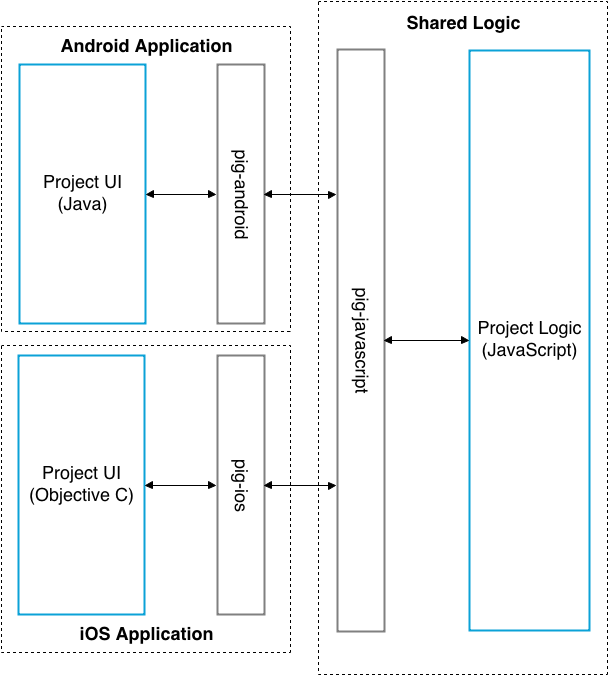

# Pig (in the middle)
**Pig is currently under heavy development and should not be used by anyone yet!**

Developing for multiple mobile platforms is both time-consuming and expensive. Writing completely separate versions in Java and Objective-C in parallel duplicates logic and wastes effort, especially when requirements change. Writing an application using PhoneGap generally leads to the UI to feeling non-standard and ultimately to a sub-par user experience.

Pig aims to solves these problems by moving the business logic into a shared Javascript codebase. On each platform (currently Android and iOS), the user interface is implemented in native code, leading the best possible user experience, while data manipulation and other logic is handled by the shared Javascript.

## What is Pig?
Your Pig enabled application will be split into at least two different parts:

- Javascript logic, which is shared between all platforms
- At least one native (Java, Objective-C) project which implements the user interface

Pig sits in the middle of these two peices of your application ([hence the name](http://en.wikipedia.org/wiki/Keep_Away)) and facilitates the exchange of data between them.

Pig has two different models for passing data between native code and Javascript: *Request/response* and an *event bus*.

### Request/Response
Request and response is used when your native code wants to send some information to the Javascript logic and expects a response, possibly including some data it can display. For example, consider an application with a login form containing an email text field, password text field and a submit button. These elements would be implemented in native code, to give a truely native user experience.

When the submit button is pressed the native code could make a *request* through Pig, passing the email and password data, to a *handler* in Javascript. This Javascript would then make a HTTP request to the API and return the *response* to the callback that the native code passed in when it made the *request*. It could also include some data, such as the newly logged in user profile.

It is the responsibility of the project using Pig to define what the handlers for your project should look like, and ensure each platforms native code is using these handlers correctly. Think of this as a similar exercise to documenting a REST API. Include enough detail to you know what data should be passed in, what you expect to be returned and what errors might encounter.

### Event Bus
The event bus is used to broadcast small pieces of data to all parts of you application. It is possible for either your native or Javascript code to emit events and these events can be listened for on either side as well. With each event you can also send a piece of JSON data.

Following on from the login example above, the Javascript may wish to emit a `user-logged-in` event when a login request is successful. We could also send the new user's profile information as data with the event. This event would give other parts of the application a chance to learn about the change in state, without having to be called directly. For example, when a login is successful a peice of Javascript might want to run to assosiated some user data the application has with the newly logged in user. At the same time a piece of user interface code might want to listen for the `user-logged-in` event and change to display some user data.

## Using Pig
### Javascript
### Android
### iOS

## API Reference

## Licence

## Contributing
